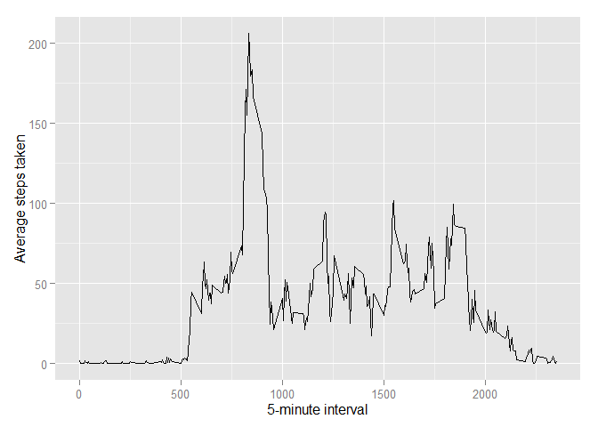

# Peer Assessment 1
Dave Verstraete  
August 3, 2015  

#Loading and preprocessing the data
Load the data (i.e. read.csv())

```r
setwd("~/Coursera Data Science Course/5 - Reproducible Research/Assignment 1/repdata_data_activity")
data <- read.csv("activity.csv")
```

Process/transform the data (if necessary) into a format suitable for your analysis

Transforming the data is not necessary at this point.

#What is mean total number of steps taken per day?
Make a histogram of the total number of steps taken each day

```r
tot_steps <- tapply(data$steps, data$date, FUN=sum, na.rm=TRUE)
library(ggplot2)
qplot(tot_steps, binwidth=1000, xlab="total number of steps taken each day")
```

 

Calculate and report the mean and median total number of steps taken per day

```r
mean(tot_steps, na.rm=TRUE)
```

```
## [1] 9354.23
```

```r
median(tot_steps, na.rm=TRUE)
```

```
## [1] 10395
```

#What is the average daily activity pattern?
1 - Make a time series plot (i.e. type = "l") of the 5-minute interval (x-axis) and the average number of steps taken, averaged across all days (y-axis)


```r
library(ggplot2)
avg <- aggregate(x=list(steps=data$steps), by=list(interval=data$interval),
                      FUN=mean, na.rm=TRUE)
ggplot(data=avg, aes(x=interval, y=steps)) +
    geom_line() +
    xlab("5-minute interval") +
    ylab("Average steps taken")
```

 

On average across all the days in the dataset, the 5-minute interval contains the maximum number of steps?


```r
avg[which.max(avg$steps),]
```

```
##     interval    steps
## 104      835 206.1698
```

#Inputing missing values

There are many days/intervals where there are missing values (coded as NA). The presence of missing days may introduce bias into some calculations or summaries of the data.

Calculate and report the total number of missing values in the dataset (i.e. the total number of rows with NAs)

```r
missing <- is.na(data$steps)
# How many missing
table(missing)
```

```
## missing
## FALSE  TRUE 
## 15264  2304
```

Devise a strategy for filling in all of the missing values in the dataset. The strategy does not need to be sophisticated. For example, you could use the mean/median for that day, or the mean for that 5-minute interval, etc.  Create a new dataset that is equal to the original dataset but with the missing data filled in.

```r
# Replace each missing value with the mean value of its 5-minute interval
missing.value <- function(steps, interval) {
    complete <- NA
    if (!is.na(steps))
        complete <- c(steps)
    else
        complete <- (avg[avg$interval==interval, "steps"])
    return(complete)
}
complete.data <- data
complete.data$steps <- mapply(missing.value, complete.data$steps, complete.data$interval)
```

Make a histogram of the total number of steps taken each day and Calculate and report the mean and median total number of steps taken per day. Do these values differ from the estimates from the first part of the assignment? What is the impact of imputing missing data on the estimates of the total daily number of steps?


```r
total.steps <- tapply(complete.data$steps, complete.data$date, FUN=sum)
qplot(total.steps, binwidth=1000, xlab="total number of steps taken each day")
```

 

```r
mean(total.steps)
```

```
## [1] 10766.19
```

```r
median(total.steps)
```

```
## [1] 10766.19
```

Mean and median values are higher after imputing missing data. The reason is that in the original data, there are some days with steps values NA for any interval. The total number of steps taken in such days are set to 0s by default. However, after replacing missing steps values with the mean steps of associated interval value, these 0 values are removed from the histogram of total number of steps taken each day.

#Are there differences in activity patterns between weekdays and weekends?

Create a new factor variable in the dataset with two levels -- "weekday" and "weekend" indicating whether a given date is a weekday or weekend day.

```r
weekday.or.weekend <- function(date) {
    day <- weekdays(date)
    if (day %in% c("Monday", "Tuesday", "Wednesday", "Thursday", "Friday"))
        return("weekday")
    else if (day %in% c("Saturday", "Sunday"))
        return("weekend")
    else
        stop("invalid date")
}
complete.data$date <- as.Date(complete.data$date)
complete.data$day <- sapply(complete.data$date, FUN=weekday.or.weekend)
```

Make a panel plot containing a time series plot (i.e. type = "l") of the 5-minute interval (x-axis) and the average number of steps taken, averaged across all weekday days or weekend days (y-axis). The plot should look something like the following, which was created using simulated data:


```r
avg <- aggregate(steps ~ interval + day, data=complete.data, mean)
ggplot(avg, aes(interval, steps)) + geom_line() + facet_grid(day ~ .) +
    xlab("5-minute interval") + ylab("Number of steps")
```

 
